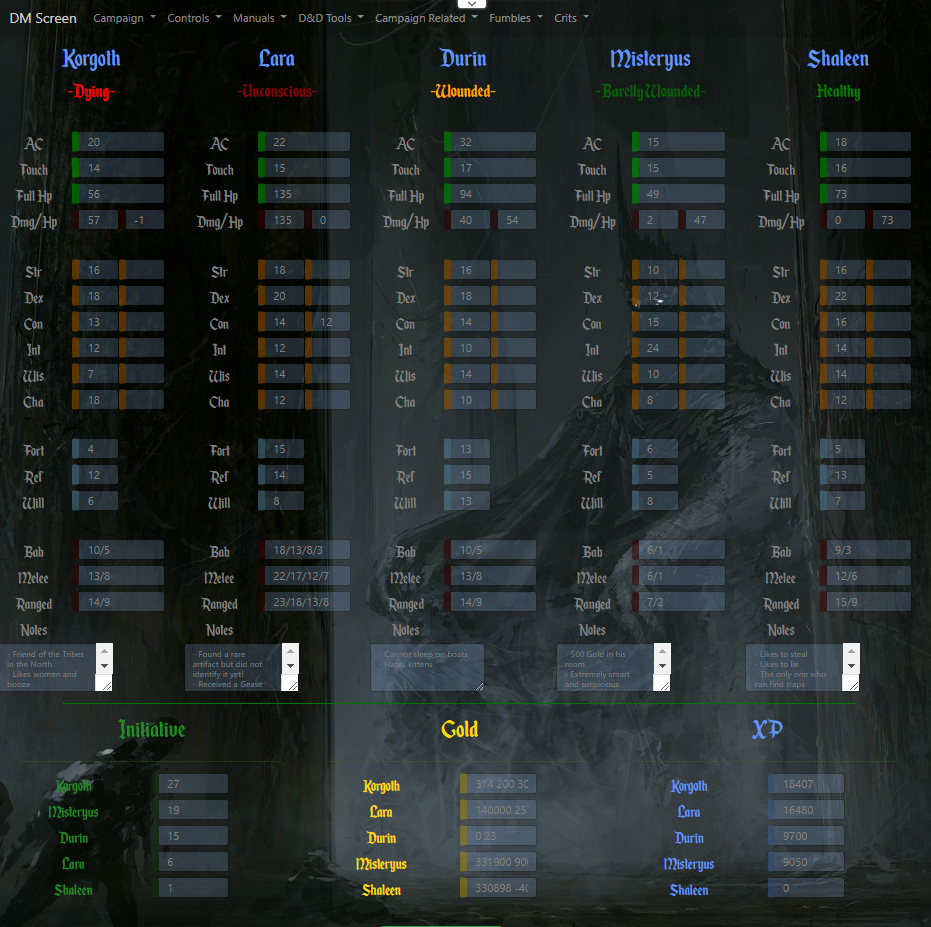
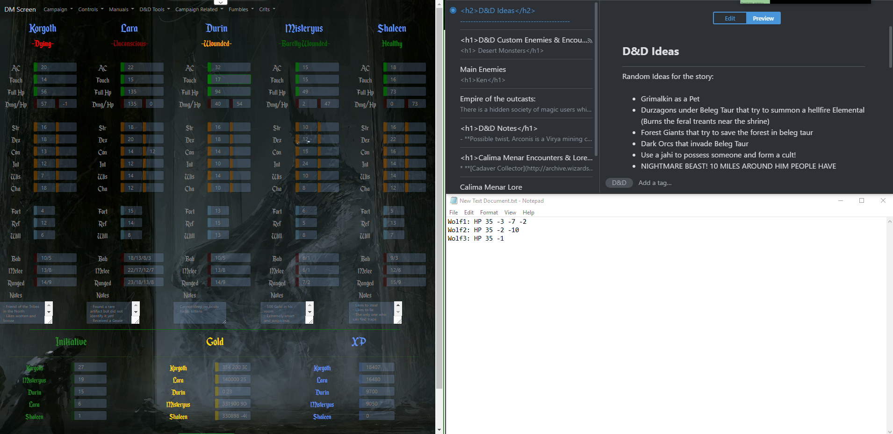
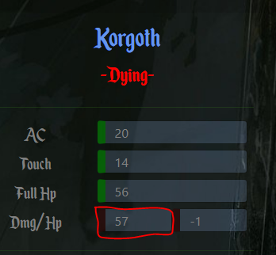
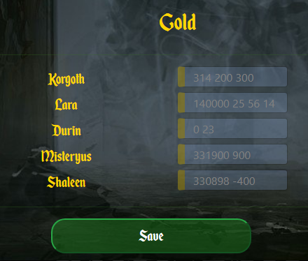

**This is a DM Screen for D&D and D&D like games**

I have made this using boostrap 4 beta and PHP. 

Now, It may not be perfect for everyone but it is for me, I needed something that could give me 
the stats of my players on half screen in a clean and easy to read manner (If you have a 
1080P screen, open this in a browser and put it on half screen, it fits perfectly!).

**Some input fields can automatically add or subtract the values found in them. Please read the readme to find out how!**

This is an example of how my screen looks when DM-ing:

**First Steps**

- **Change the $refreshLink variable in the dmscreen.php (line 8) with the link to the dm screen page location**

Create a new campaign! To to this, click on Campaigns on the navbar, click on Create campaign
Write a name in the input and press the create button 

**Second Step**

Good, now you have a campaign, it's time to add the players!
- Go to Controls in the navbar
- Click Create Character
- Press to Go button

*Currently there is a bug if you only have 1 player that shows some input fields out of place...I'll fix it in the future. Buuut....if
you only have one player, I think that you should work on fixing that :P* 
This does not happen if you have 2 or more players added.

**Third step**

Now that you have your players saved in the campaign, fill in their stats!
The Input fields on the right side of the stats (str,dex,con etc...) are for 
temporary modifiers/scores.

If you select any input and press enter, the values present in all the input fields are sent and
saved.

**Damage and Remaining HP**

When dealing damage to your player, write that damage in the DMG input field (the 4th field
from the top to the bottom, on the left side) then deselect it. *This will automatically
Subtract the damage from the total hp of the player AND modify the condition of the player's
health (Healthy, Barelly Wounded, Wounded, Badly Wounded, etc...). *
The DMG input field automatically adds the damage scores written there. Add damages there
with a space between them (like: 34 25 10) and it will automatically sum them when the field 
is deselected.

To heal a player but a negative value in the input field (-25).

**Initiative**

Write the initiative score for each player and then press Save. 
When the page reloads, the players will be sorted by initiative score.

**Gold & Experience**

To add Gold or Experience add a value near the old value withing the input field:

Player1 Gold/XP: 250 400 300

Then press Save, this will add all the values contained in the input field.

Of course to take gold or xp put a negative value in the field near the old value (-250)

**Fumbles and Crits**

In the navbar, you will see a funbles and a crits dropdown. If you click the options
it will pop up a message that describes a secondary effect of the crit strike.
Feel free to add some more if you want to (in the arrays found starting line 155 in dmscreen.php)

**Other links**
I've put some usefull links in some navbar dropdowns like, manuals, map generators, 
name generators etc... Feel free to add other links.

Have fun peeps!

**The Background Image and the font are not mine and I do not know the authors, if anyone
has a problem with me using them, please email me**

*Feel free to add stuff or modify as needed. All the dependencies are included in the repo.
You only need PHP and a Webserver to use this. For any questions please contact me at 
tudor.palade@bigteddy.ro*